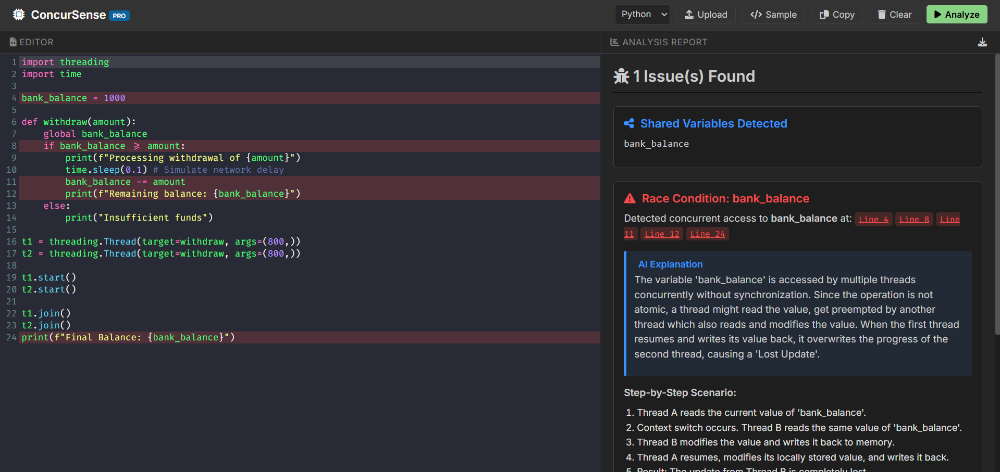

# ConcurSense | Race Condition Detection Tool

ConcurSense is a professional-grade developer utility designed to detect potential race conditions in concurrent code through static analysis. It provides actionable insights, AI-driven explanations, and suggested remediations to help developers build robust and thread-safe applications.



## 🚀 Features

- **Static Analysis**: Detects shared variables and concurrent access patterns in Python and C/C++ code.
- **Modern UI**: A sleek, VS Code-inspired dark interface built for developer productivity.
- **Interactive Editor**: Full-featured code editor powered by CodeMirror with syntax highlighting and line jumping.
- **AI Explanations**: Provides deep insights into *why* a specific piece of code is vulnerable to a race condition.
- **Step-by-Step Scenarios**: Visualizes potential interleaving scenarios that lead to bugs.
- **Automated Fixes**: Generates suggested code fixes using best practices like Mutexes and Locks.
- **PDF Report Generation**: Export professional analysis reports for documentation and review.
- **File Support**: Upload source files directly or extract code from existing PDF documentation.

## 🛠️ Tech Stack

- **Backend**: Python, Flask
- **Frontend**: Vanilla HTML5, CSS3, JavaScript
- **Editor**: CodeMirror 5
- **Icons & Fonts**: FontAwesome 6, Google Fonts (Inter, Fira Code)
- **PDF Processing**: PyMuPDF (fitz)
- **Export**: html2pdf.js, html2canvas, jsPDF

## 📦 Installation

1. **Clone the repository**:
   ```bash
   git clone https://github.com/your-username/Race-Detection-Analyzer.git
   cd Race-Detection-Analyzer
   ```

2. **Install dependencies**:
   ```bash
   pip install -r requirements.txt
   ```

3. **Run the application**:
   ```bash
   python app.py
   ```

4. **Access the tool**:
   Open [http://127.0.0.1:5000](http://127.0.0.1:5000) in your browser.

## 📖 Usage

1. **Input Code**: Type or paste your code into the editor, or use the **Upload** button to load a file.
2. **Select Language**: Choose between Python and C from the dropdown menu.
3. **Analyze**: Click the **Analyze** button to start the detection process.
4. **Review**: Check the right-hand panel for detected issues, AI explanations, and suggested fixes.
5. **Navigate**: Click on line tags (e.g., `Line 12`) to jump directly to the relevant code in the editor.
6. **Export**: Click the **Download** icon in the analysis header to generate a professional PDF report.

## 🛡️ Analysis Engine

The tool uses a heuristic-based static analysis engine that:
- Identifies shared state (global variables in Python, global scope variables in C).
- Tracks read/write access points across the codebase.
- Flags variables that are accessed in multiple locations without explicit synchronization primitives.
- Simulates preemption points to explain potential data races.

## 🤝 Contributing

Contributions are welcome! If you have suggestions for new features or improvements to the detection algorithms, feel free to open an issue or submit a pull request.

## 📄 License

This project is licensed under the MIT License - see the LICENSE file for details.

---
*Generated by ConcurSense for educational and professional analysis purposes.*
